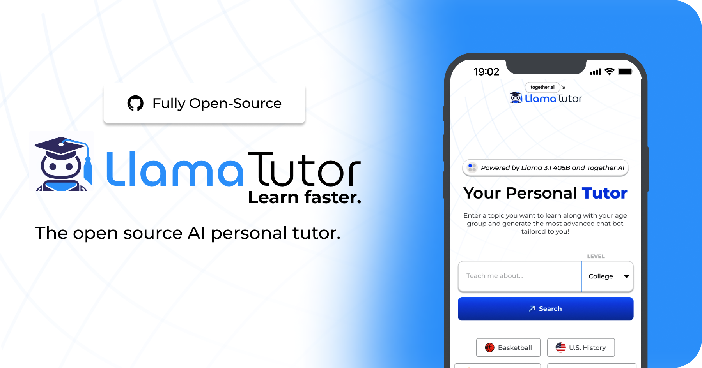

<a href="https://www.llamatutor.com">
  
  <h1 align="center">NOVA</h1>
</a>

<p align="center">
  An open-source AI-powered personal tutoring platform with full LMS integration
</p>

<p align="center">
  <strong>Powered by Llama 3.1 70B, RAG, and LTI 1.3</strong>
</p>

---

## Overview

**NOVA** (formerly Llama Tutor) is a sophisticated AI tutoring application that provides personalized, interactive learning experiences. Built for educational institutions, NOVA seamlessly integrates with Learning Management Systems (Canvas, Moodle, D2L, Blackboard) and features advanced capabilities like Retrieval Augmented Generation (RAG), multi-chatbot support, and instructor dashboards.

### Key Features

- **AI-Powered Tutoring** - Interactive learning with Llama 3.1 70B, customizable by age group
- **LMS Integration** - Full LTI 1.3 support for Canvas, Moodle, D2L, and Blackboard
- **RAG (Retrieval Augmented Generation)** - Upload PDFs/DOCX and get contextual answers from course materials
- **Multi-Chatbot System** - Create independent AI tutors for different subjects
- **Instructor Dashboard** - Upload materials, manage courses, track analytics
- **Admin Controls** - Configure AI behavior, response templates, and restrictions
- **Chat History** - Persistent conversation sessions across devices
- **Study Planning** - Google Calendar integration for personalized schedules
- **Web Search Integration** - Real-time educational content retrieval
- **Response Templates** - Step-by-Step, Socratic Method, and Analogies teaching styles

---

## Tech Stack

### Core Technologies
- **Next.js 14** (App Router) with TypeScript
- **React 18** with Server Components
- **Tailwind CSS** for styling
- **Supabase** - Authentication and PostgreSQL database with Row Level Security

### AI & Search
- **Together AI** - LLM inference (Llama 3.1 8B Instruct Turbo)
- **OpenAI** - Text embeddings (text-embedding-3-small) for RAG
- **Helicone** - LLM observability and monitoring
- **Serper API** or **Bing Search API** - Web search for educational content

### Document Processing & Storage
- **pdf-parse-fork** - PDF text extraction
- **Mammoth** - DOCX text extraction
- **pgvector** - Vector similarity search for embeddings
- **Mozilla Readability** - Clean content extraction from web pages

### Integrations
- **LTI 1.3** - LMS integration with OIDC authentication
- **Google Calendar API** - Study planning integration
- **Upstash Redis** - Rate limiting (optional)

### DevOps
- **Plausible Analytics** - Privacy-friendly analytics
- **jose** - JWT signing and verification for LTI

---

## Quick Start

### Prerequisites

- Node.js 18+ and npm
- Supabase account
- Together AI API key
- Serper API key (or Bing Search API key)
- Helicone API key
- OpenAI API key (for embeddings)

### Installation

1. **Clone the repository**
   ```bash
   git clone https://github.com/yourusername/NOVA.git
   cd NOVA
   ```

2. **Install dependencies**
   ```bash
   npm install
   ```

3. **Set up Supabase**
   - Create a new Supabase project at [supabase.com](https://supabase.com)
   - Run the migrations in `supabase/migrations/` in order
   - Enable pgvector extension in SQL editor:
     ```sql
     CREATE EXTENSION IF NOT EXISTS vector;
     ```

4. **Configure environment variables**
   ```bash
   cp .example.env .env.local
   ```

   Edit `.env.local` with your API keys:
   ```env
   # Required - LLM Inference
   TOGETHER_API_KEY=your_together_api_key

   # Required - Web Search (choose one)
   SERPER_API_KEY=your_serper_api_key
   # OR
   BING_API_KEY=your_bing_api_key

   # Required - Observability
   HELICONE_API_KEY=your_helicone_api_key

   # Required - Database & Auth
   NEXT_PUBLIC_SUPABASE_URL=https://your-project.supabase.co
   NEXT_PUBLIC_SUPABASE_ANON_KEY=your_anon_key
   SUPABASE_SERVICE_ROLE_KEY=your_service_role_key

   # Required - Embeddings for RAG
   OPENAI_API_KEY=your_openai_api_key

   # Optional - Rate Limiting
   UPSTASH_REDIS_REST_URL=your_upstash_url
   UPSTASH_REDIS_REST_TOKEN=your_upstash_token

   # Optional - Google Calendar Integration
   GOOGLE_CLIENT_ID=your_google_client_id
   GOOGLE_CLIENT_SECRET=your_google_client_secret

   # Required - App URL
   NEXT_PUBLIC_BASE_URL=http://localhost:3000
   ```

5. **Run the development server**
   ```bash
   npm run dev
   ```

   Open [http://localhost:3000](http://localhost:3000) in your browser.

### Production Build

```bash
npm run build
npm start
```

---

## Architecture

### Authentication Flow

1. **Supabase Auth** (Primary)
   - JWT-based authentication with magic links or OAuth
   - Bearer token validation in middleware
   - Role-based access control (student/instructor/admin)

2. **LTI 1.3** (LMS Integration)
   - OIDC authentication flow
   - Automatic user provisioning from LMS
   - Course context mapping to NOVA chatbots

### Data Flow

```
User Query → Web Search → Content Parsing → RAG Semantic Search
                                              ↓
                                    LLM (Llama 3.1) + Context
                                              ↓
                                    Streaming Response (SSE)
```

### Database Schema

**Core Tables:**
- `users` - User profiles with roles
- `ai_config` - Global AI configuration
- `chatbots` - Independent tutoring agents
- `course_materials` - Document storage
- `document_chunks` - Vector embeddings for RAG
- `chat_sessions` - Conversation sessions
- `chat_messages` - Message history

**LTI Tables:**
- `lti_platforms` - LMS configuration
- `lti_contexts` - Course mappings
- `lti_user_mappings` - User linking
- `lti_enrollments` - Enrollment tracking
- 4 additional tables for sync and session management

### API Routes

**Core Tutoring:**
- `POST /api/getSources` - Search educational content
- `POST /api/getParsedSources` - Extract and clean content
- `POST /api/getChat` - Stream AI responses with RAG

**Chatbot Management:**
- `GET/POST /api/chatbots` - List and create chatbots
- `GET/PUT/DELETE /api/chatbots/[id]` - Manage chatbots

**Course Materials:**
- `POST /api/course-materials/upload` - Upload PDF/DOCX with chunking
- `GET/POST/PUT/DELETE /api/course-materials` - CRUD operations

**LTI Integration:**
- `POST /api/lti/login` - OIDC login initiation
- `POST /api/lti/launch` - Resource launch with JWT verification
- `GET /api/lti/jwks` - Public key set for LMS
- `POST /api/lti/sync/nrps` - Roster synchronization

**Chat History:**
- `GET/POST /api/chat-history/sessions` - Session management
- `GET /api/chat-history/sessions/[id]/messages` - Message history

---

## Key Components

### Pages

- **`/`** - Landing page with feature showcase
- **`/auth/login`** - Authentication page
- **`/home`** - User dashboard (authenticated)
- **`/chat`** - Main tutoring interface
- **`/admin`** - Admin configuration panel
- **`/instructor`** - Instructor course management

### Major Components

- **`AdminDashboard.tsx`** - Comprehensive admin panel
  - AI configuration (tokens, temperature, blocked topics)
  - Response template management
  - Chatbot CRUD operations
  - Instructor role management
  - LMS platform configuration

- **`InstructorDashboard.tsx`** - Instructor features
  - Course overview and analytics
  - Material upload (PDF, DOCX)
  - Attendance tracking
  - Assessment tools

- **`Chat.tsx`** - Message display with Markdown rendering
- **`ChatHistory.tsx`** - Session history sidebar
- **`LMSIntegration.tsx`** - LTI platform setup wizard

### Utilities

- **`utils/lti.ts`** - LTI 1.3 verification and role mapping
- **`utils/documentProcessor.ts`** - PDF/DOCX chunking
- **`utils/embeddings.ts`** - OpenAI embedding generation
- **`utils/TogetherAIStream.ts`** - Custom SSE streaming
- **`utils/googleCalendar.ts`** - Calendar integration

---

## Features in Detail

### RAG (Retrieval Augmented Generation)

Upload course materials (PDF, DOCX) which are:
1. Parsed and extracted into plain text
2. Split into 1000-character chunks with 100-character overlap
3. Converted to vector embeddings (OpenAI text-embedding-3-small)
4. Stored in PostgreSQL with pgvector
5. Semantically searched during chat to provide relevant context

### Multi-Chatbot System

Create multiple independent AI tutors:
- Custom system prompts per chatbot
- Subject-specific knowledge bases
- Toggle web search per chatbot
- Attach course materials per chatbot
- Active/inactive status management

### LMS Integration (LTI 1.3)

Full Learning Management System integration:
- OIDC authentication flow
- Automatic user provisioning
- Course context mapping
- Names & Roles Provisioning (NRPS) sync
- Deep linking support
- Assignment & Grade Services (AGS) framework ready

### Response Templates

Three teaching styles that can be mixed:
- **Step-by-Step** - Break down complex topics into sequential steps
- **Socratic Method** - Guide learning through questions
- **Analogies** - Explain concepts using relatable examples

### Study Planning

Google Calendar integration:
- OAuth 2.0 authentication
- Fetch upcoming deadlines and assignments
- AI-generated personalized study schedules
- Contextual learning recommendations

---

## Configuration

### Admin Dashboard

Access at `/admin` (requires admin role):
- Configure AI restrictions (max tokens, temperature)
- Block specific topics
- Enable/disable response templates
- Create and manage chatbots
- Upload course materials
- Assign instructor roles
- Configure LMS platforms

### Environment Variables

| Variable | Required | Description |
|----------|----------|-------------|
| `TOGETHER_API_KEY` | Yes | Together AI API key for LLM inference |
| `SERPER_API_KEY` | Yes* | Serper API key for web search |
| `BING_API_KEY` | Yes* | Alternative to Serper (use one) |
| `HELICONE_API_KEY` | Yes | Helicone API key for observability |
| `OPENAI_API_KEY` | Yes | OpenAI API key for embeddings |
| `NEXT_PUBLIC_SUPABASE_URL` | Yes | Supabase project URL |
| `NEXT_PUBLIC_SUPABASE_ANON_KEY` | Yes | Supabase anonymous key |
| `SUPABASE_SERVICE_ROLE_KEY` | Yes | Supabase service role key |
| `UPSTASH_REDIS_REST_URL` | No | Upstash Redis URL for rate limiting |
| `UPSTASH_REDIS_REST_TOKEN` | No | Upstash Redis token |
| `GOOGLE_CLIENT_ID` | No | Google OAuth client ID |
| `GOOGLE_CLIENT_SECRET` | No | Google OAuth client secret |
| `NEXT_PUBLIC_BASE_URL` | Yes | Application base URL |

---

## Security

- **Row Level Security (RLS)** enabled on all database tables
- **JWT authentication** with Bearer token validation
- **Rate limiting** (10 requests per 24 hours) via Upstash Redis
- **Input validation** against configured blocked topics
- **LTI token verification** with platform JWKS
- **OAuth 2.0** for third-party integrations
- **HTTPS-only** for production deployments

---

## Development

### Commands

```bash
# Install dependencies
npm install

# Run development server
npm run dev

# Build for production
npm run build

# Start production server
npm start

# Run linter
npm run lint
```

### Project Structure

```
app/              # Next.js App Router (pages & API routes)
components/       # React components
utils/            # Utility functions and helpers
supabase/         # Database migrations
middleware.ts     # Auth validation middleware
```

### Adding a New Feature

1. Create API route in `app/api/your-feature/route.ts`
2. Add database migration in `supabase/migrations/`
3. Create React components in `components/`
4. Update types if needed
5. Test with different user roles

---

## Deployment

### Vercel (Recommended)

1. Push code to GitHub
2. Import project in Vercel
3. Add environment variables in Vercel dashboard
4. Deploy

### Other Platforms

Compatible with any Node.js hosting platform:
- Railway
- Render
- AWS Amplify
- Google Cloud Run
- DigitalOcean App Platform

Ensure environment variables are configured and PostgreSQL with pgvector is available.

---

## Monitoring & Observability

- **Helicone Dashboard** - LLM request logs, costs, latency
- **Supabase Dashboard** - Database queries, auth sessions, logs
- **Plausible Analytics** - Privacy-friendly web analytics
- **Console Logs** - Extensive API route logging for debugging

---

## Roadmap

### Completed Features
- Authentication with Supabase
- Chat history and session management
- RAG with document uploads
- LTI 1.3 integration
- Multi-chatbot support
- Instructor dashboard
- Admin configuration panel
- Google Calendar integration
- Response templates
- Rate limiting

### Future Enhancements
- [ ] PPTX document processing
- [ ] Assignment & Grade Services (AGS) implementation
- [ ] Advanced analytics dashboard
- [ ] Multi-language support (i18n)
- [ ] Hybrid search (BM25 + semantic)
- [ ] WCAG 2.1 AA accessibility compliance
- [ ] Mobile app (React Native)
- [ ] Collaborative learning features
- [ ] Video content integration
- [ ] Voice interaction support

---

## Contributing

Contributions are welcome! Please:

1. Fork the repository
2. Create a feature branch (`git checkout -b feature/amazing-feature`)
3. Commit your changes (`git commit -m 'Add amazing feature'`)
4. Push to the branch (`git push origin feature/amazing-feature`)
5. Open a Pull Request

---

## License

This project is open source and available under the [MIT License](LICENSE).

---

## Support

For issues, questions, or feature requests:
- Open an issue on GitHub
- Check existing documentation in the repository
- Review the `CLAUDE.md` file for development guidance

---

## Acknowledgments

- **Meta** - Llama 3.1 70B language model
- **Together AI** - LLM inference platform
- **Supabase** - Backend-as-a-Service
- **OpenAI** - Embedding models
- **Helicone** - LLM observability
- **Vercel** - Next.js framework and hosting

---

<p align="center">
  Built with ❤️ for educators and learners worldwide
</p>
